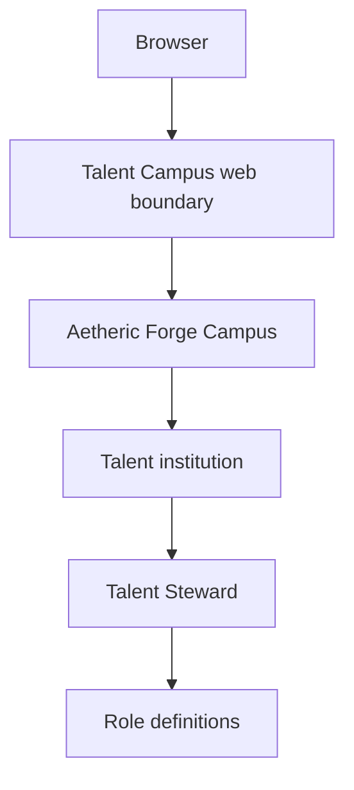

# Talent Campus architecture

Talent Campus is a standalone application composed as an Aetheric Forge Campus. Its first application institution is Talent.

## Institutional responsibility

Talent owns the relationship between needed capabilities, defined roles, potential talent, evidence of suitability, and approved assignments. It does not own:

- authentication or stable identity;
- payroll or benefits administration;
- security permissions;
- project execution; or
- vendor-specific recruiting records.

Those concerns are referenced through institutional contracts or external providers as concrete workflows require them.

## Shared model

Human and artificial talent share an outer lifecycle but remain distinct kinds of participant. The shared model begins with `RoleDefinition`, which records a role's name, purpose, and required capabilities. Candidate, evaluation, assignment, and development models will be introduced through user stories rather than anticipated infrastructure.

## Composition

The web project is the composition root. Domain objects do not depend on Razor, persistence, identity providers, or recruiting vendors.
